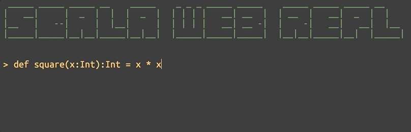

# Scala Web REPL

[](https://travis-ci.com/jdin/scala-web-repl) 

Client/Server Application that imitates Scala REPL in a browser.
You can play with it [here](https://scala-web-repl.herokuapp.com/).



## How to build

```shell script
sbt universal:packageBin
```

## How to start

Development mode:
```shell script
sbt run
```

Production mode:
```shell script
sbt stage
./target/universal/stage/bin/scala-web-repl 
```

## License

MIT
